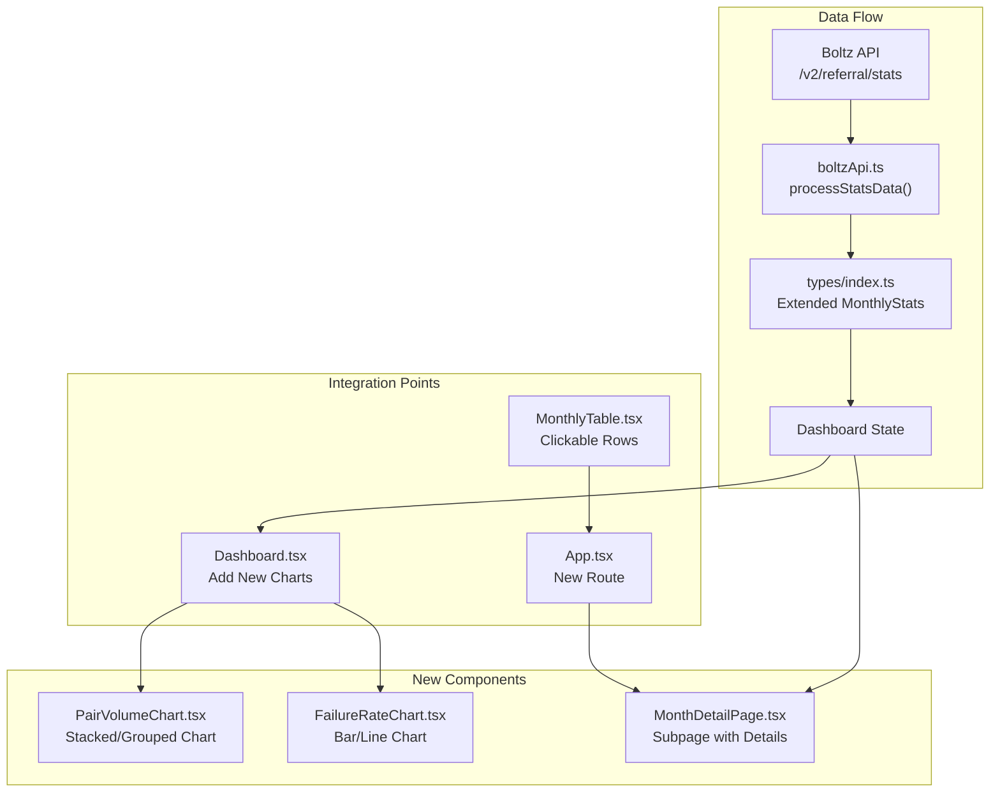

## Overview

This plan implements three major dashboard enhancements:

1. **Per-pair volume graphs** - Show individual volume for each trading pair
   (BTC/BTC, L-BTC/BTC, etc.)
2. **Swap failure rates graph** - Display failure rates by swap type (submarine,
   reverse, chain)
3. **Month detail subpages** - Drill-down view for each month showing detailed
   metrics

## Current Data Available (Not Currently Used)

The Boltz API `/v2/referral/stats` already provides per-pair breakdowns and
failure rates that are currently discarded:

```json
{
    "2024": {
        "1": {
            "volume": {
                "total": "1.23456789",
                "BTC/BTC": "0.5",
                "L-BTC/BTC": "0.73456789"
            },
            "trades": {
                "total": 150,
                "BTC/BTC": 75,
                "L-BTC/BTC": 75
            },
            "failureRates": {
                "submarine": 0.12,
                "reverse": 0.05,
                "chain": 0.08
            }
        }
    }
}
```

## Implementation Plan

### Phase 1: Update Data Types and API Processing

**File: `src/types/index.ts`**

- Extend `MonthlyStats` interface to include:
    - `pairVolume: Record<string, number>` - Volume per trading pair
    - `pairTrades: Record<string, number>` - Trade count per pair
    - `failureRates: { submarine: number; reverse: number; chain: number }`

**File: `src/services/boltzApi.ts`**

- Update `processStatsData()` to extract per-pair data from API response
- Extract `failureRates` for each month
- Extract volume/trades per pair (excluding "total" key)

### Phase 2: Per-Pair Volume Graph

**Option A: Single Stacked/Grouped Chart (Recommended First)** **File:
`src/components/PairVolumeChart.tsx` (new)**

- Use Recharts `BarChart` with grouped bars or `AreaChart` with stacked areas
- Display all pairs in one chart with different colors
- Legend to toggle pairs on/off
- Color scheme: Use distinct colors per pair (BTC/BTC = orange, L-BTC/BTC =
  blue, etc.)

**Option B: Separate Charts (If Option A is too crowded)**

- Create a grid of smaller charts, one per pair
- Show up to 2-3 pairs side by side
- Use tabs or dropdown if there are many pairs

**File: `src/components/Dashboard.tsx`**

- Add the pair volume chart below existing charts
- Consider replacing or supplementing the total volume chart

### Phase 3: Swap Failure Rates Graph

**File: `src/components/FailureRateChart.tsx` (new)**

- Use Recharts `BarChart` or `AreaChart`
- Display three data series: submarine, reverse, chain failure rates
- Y-axis: Percentage (0-100%)
- Color coding: Submarine = #4fadc2, Reverse = #f7931a, Chain = #e74c3c
- Tooltip showing exact percentage per swap type

**File: `src/components/Dashboard.tsx`**

- Add failure rate chart to the chart grid (2-column layout)
- Position alongside other metrics for balanced layout

### Phase 4: Month Detail Subpage

**File: `src/App.tsx`**

- Add new route: `/month/:year/:month`
- Protected route wrapper like existing dashboard

**File: `src/pages/MonthDetailPage.tsx` (new)** Layout structure:

```
Header (Month/Year, Back button)
├── Summary Cards (Total Volume, Total Swaps, Avg Swap Size)
├── Failure Rates Section
│   ├── Bar chart showing submarine/reverse/chain rates
│   └── Comparison to all-time averages
├── Pair Volume Trends (as selected by user)
│   ├── Line chart comparing pairs over full history
│   └── Highlighted indicator for selected month
├── Volume Per Pair Table
│   ├── Pair name, Volume, Swaps, Avg Size
│   └── Percentage of total for that month
└── Daily Breakdown (as selected by user)
    ├── Placeholder note: "Daily data not yet available from API"
    └── Future enhancement: bar chart of daily volume within month
```

**File: `src/components/MonthlyTable.tsx`**

- Make month rows clickable
- Add hover state indicating clickability
- On click, navigate to `/month/:year/:month`

**Additional Metrics for Month Detail Page** Based on available data, the
following can be displayed:

- Pair distribution pie chart (percentage breakdown)
- Month-over-month growth rate per pair
- Average swap size per pair
- Comparison to historical averages
- Best/worst performing pair

### Phase 5: Internationalization

**File: `src/i18n.ts`**

- Add translations for new UI elements:
    - "Volume by Pair", "Swap Failure Rates"
    - "Month Details", "Daily Breakdown"
    - "Pair", "Submarine", "Reverse", "Chain"

## Mermaid Architecture Diagram



## File Changes Summary

| File                                  | Change Type | Description                          |
| ------------------------------------- | ----------- | ------------------------------------ |
| `src/types/index.ts`                  | Modify      | Add per-pair and failure rate fields |
| `src/services/boltzApi.ts`            | Modify      | Extract additional data from API     |
| `src/components/PairVolumeChart.tsx`  | Create      | New chart component for pair volumes |
| `src/components/FailureRateChart.tsx` | Create      | New chart for failure rates          |
| `src/components/MonthlyTable.tsx`     | Modify      | Add click navigation                 |
| `src/components/Dashboard.tsx`        | Modify      | Integrate new charts                 |
| `src/pages/MonthDetailPage.tsx`       | Create      | Month detail subpage                 |
| `src/App.tsx`                         | Modify      | Add routing for subpage              |
| `src/i18n.ts`                         | Modify      | Add new translation keys             |

## Open Decision: Pair Volume Display

As requested, I'll implement both options so you can decide:

1. **Option A (Single Chart)**: Stacked area or grouped bar chart showing all
   pairs together
2. **Option B (Separate Charts)**: Individual mini-charts per pair in a grid
   layout

Both will be created as separate components (`PairVolumeChartCombined.tsx` and
`PairVolumeChartSeparate.tsx`) and you can toggle between them in the Dashboard
to see which looks better with your actual data.

## Notes on Daily Breakdown

The Boltz API does not currently provide daily-level granularity. The finest
granularity available is monthly. For the "Daily Breakdown" feature, I will:

- Create the UI structure for future daily data
- Display a placeholder message explaining daily data is not yet available
- The component will be ready to integrate once Boltz adds daily granularity to
  the API
